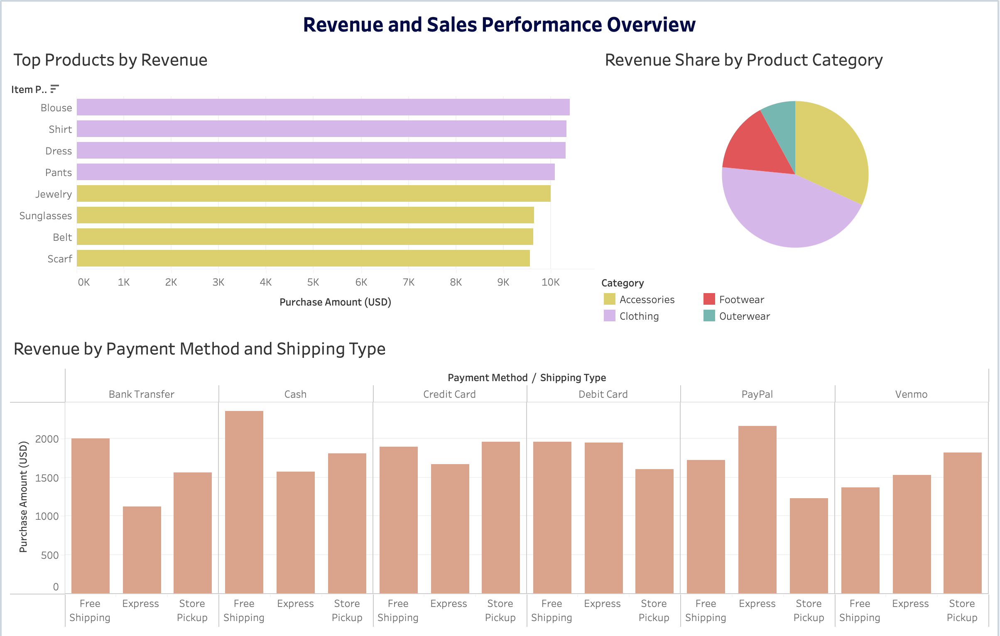
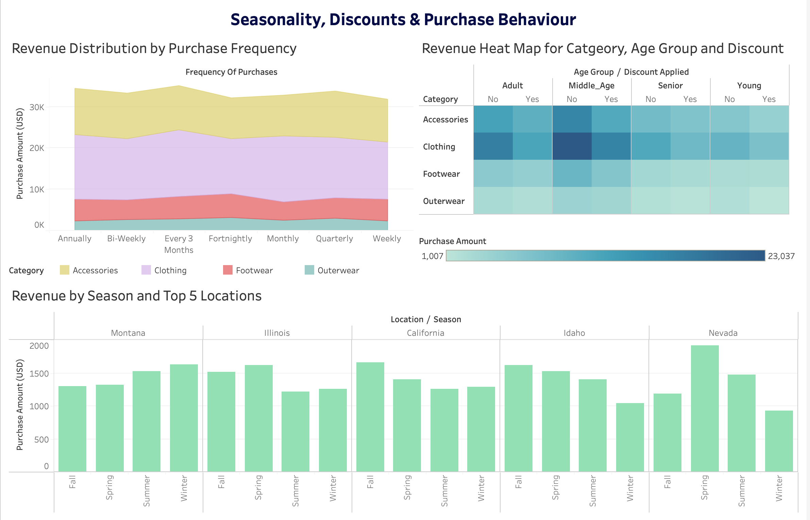
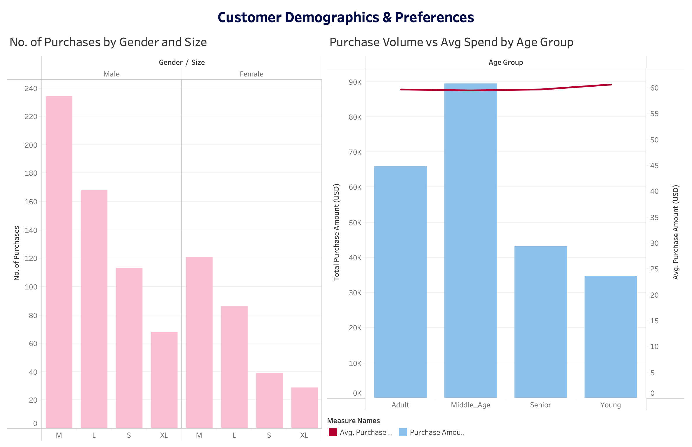

# Customer Behavior Analytics

An end-to-end **data analytics project** analyzing customer shopping behavior to uncover key revenue drivers, purchasing patterns, and actionable business insights using **Python, SQL, and Tableau**.

---

## 📌 Project Overview

This project analyzes **3,900 customer purchase transactions** across demographics, product categories, discounts, subscriptions, and purchase frequency.  
The goal is to identify **what actually drives revenue** and translate technical analysis into **business-ready insights**.

The analysis follows a complete analytics workflow:
- Data cleaning & feature engineering (Python / Pandas)
- Business-driven querying & validation (MySQL)
- Interactive dashboards & storytelling (Tableau)
- Final presentation (PPT)

---

## 🧰 Tech Stack

- **Python**: Pandas, Matplotlib  
- **SQL**: MySQL (window functions, ranking, segmentation)  
- **Visualization**: Tableau  

---

## 📂 Dataset Summary

- **Records:** 3,900 transactions  
- **Features:** 18 columns  
- **Key Dimensions:**
  - Demographics: age, gender, location, size
  - Purchases: category, item, amount, season
  - Behavior: discounts, subscriptions, frequency, previous purchases
- **Missing Data:**
  - 37 missing values in `review_rating`  
  - Handled using **category-wise median imputation**

---

## 🔧 Data Preparation & Feature Engineering

Key preprocessing steps:
- Category-wise median imputation for review ratings
- Column standardization using `snake_case`
- Engineered features:
  - `age_group` (Young, Adult, Middle-aged, Senior)
  - Numeric purchase frequency (`purchase_freq_days`)
  - Repeat-customer flags
  - Customer segmentation (New, Occasional, Regular, Heavy)
  - Estimated annual customer value
- Removed redundant fields after validation (`promo_code_used`)

---

## 📊 Exploratory Analysis (Python)

Major analytical themes:
- **Age vs Revenue**:  
  Average spend per transaction is nearly constant (~$60); revenue differences are driven by **purchase frequency**, not spend size.
- **Discount Impact**:  
  Discounts do not increase per-transaction spending uniformly; effectiveness varies by category.
- **Ratings vs Revenue**:  
  Product ratings do not directly correlate with revenue.
- **Customer Loyalty**:  
  ~89% of customers are repeat buyers; high-frequency customers generate most revenue.
- **Subscription Analysis**:  
  Subscriptions slightly improve retention but do not significantly increase spending.

---

## 🗄️ SQL Business Analysis (MySQL)

Executed **20+ business-focused SQL queries**, including:
- Revenue contribution and percentage share
- High-value discount users
- Top-rated and most-purchased products
- Customer segmentation (New / Returning / Loyal)
- Frequency vs revenue analysis
- Seasonal and location-based trends
- Payment method and discount usage patterns

Advanced SQL techniques used:
- Window functions (`ROW_NUMBER`, `OVER`)
- Conditional aggregation
- Ranking and segmentation logic

---

## 📈 Tableau Dashboards

Below are snapshots of the final Tableau dashboards created as part of this project:

### 1️⃣ Revenue & Sales Performance Overview

### 2️⃣ Seasonality, Discounts & Purchase Behavior

### 3️⃣ Customer Demographics & Preferences

---

## 💡 Key Insights

- Revenue growth is **frequency-driven**, not transaction-size driven
- Middle-aged customers contribute the highest revenue due to frequent purchases
- Discounts are effective only in specific categories
- Repeat customers dominate total revenue
- Subscriptions slightly improve retention but do not drive major revenue lift

---

## 🎯 Business Recommendations

- Focus loyalty programs on increasing purchase frequency
- Apply discounts selectively by category
- Optimize subscriptions for long-term engagement, not discounts
- Prioritize high-revenue products in marketing regardless of ratings
- Target middle-aged and high-frequency customer segments

---

## 📑 Final Deliverable

- **Executive-ready presentation (PPT)** summarizing insights and recommendations  
- Designed for stakeholders

